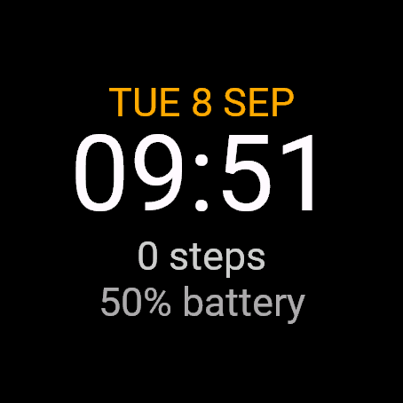

# Phase-one validation

Standalone migration verified: 2026-09-09. Original simulator session: 2026-09-08. Target: Forerunner 970, device ID `fr970`.

## Completed

- Read repository `AGENTS.md` and installed Next.js 16.3.1 server/client, CSS and route-handler guides before implementation.
- Standalone Next.js 16.3.4 production build succeeds. Editor `/` returns HTTP 200; the old `/watchface` path redirects to it. Same-origin `/api` routes run the compiler. No separate service is needed.
- Standalone ESLint and TypeScript checks pass. Dependency audit reports zero vulnerabilities.
- All 10 standalone watchface tests pass, covering design export/import, fresh-store reload after autosave, corrupt project recovery, unavailable storage, shared render/source mapping, untrusted input rejection, queue bounds, missing compiler errors, timeout termination and excessive output termination.
- `services/watchface/smoke.mjs` exercises the actual local HTTP compiler: rejects unauthorized origins, unknown/source fields and oversized payloads, rejects missing artifact downloads, observes queued jobs, compiles the starter and three edited design variants and downloads the resulting binary bytes. No compiler mock is used.
- Official Connect IQ SDK **9.2.0**, Temurin **17.0.20.1**, installed `fr970` profile, private RSA 4096-bit signing key outside the repository.
- Repeated all four compiler builds through the standalone production app on 2026-09-09. All four hashes match the original build artifacts exactly; the simulator evidence below applies to the identical starter binary.
- The starter compiles to a signed **15,644-byte** `.prg`. SHA-256: `06c588c63c5ccb1e44c64a9530c6cb67c89a0bcdfde195d333eba406cabc2cb1`.
- Three edited variants also compile successfully: `small`, `medium` and `large` native font sizes, changed steps color and battery position. The starter is compiled separately and covers large time with small text.
- The real downloaded starter `.prg` was loaded with the SDK's MonkeyDo into **Forerunner 970 (6.0.2)** simulator. Its first screenshot visibly shows time `09:51`, date `TUE 8 SEP`, `0 steps`, and `50% battery`.
- Changed simulator settings to 24-hour time and 82% battery. Native simulator screen visibly shows `21:57`, the same date, `0 steps`, and `82% battery` after wake. This verifies runtime device values are used, not browser sample data.
- Switched simulator display mode to Always-On: screen blanks. Switched back to High Power: all four fields return. No MonkeyDo runtime error was reported during these checks.



## Limits

- No physical watch has been used. USB instructions are device/documentation-grounded, not a completed transfer test. Windows compiler setup is documented but this implementation was executed on Mac.
- No automated browser click/visual-regression suite was run. Persistence tests exercise the actual browser-store implementation through a storage adapter; the route was verified over HTTP. Browser font shapes are intentionally approximate and labeled.
- Nonzero step mutation, midnight/date rollover, long-value clipping on hardware, multiple locales, battery endurance and physical sleep/gesture behavior remain in the real-watch checklist.
- SDK screen capture can catch a partial redraw. The included capture is a complete frame; wake rendering was also inspected directly in the simulator.
- This is a personal local Node app. No hosted compiler or website deployment was attempted.

## Reproduce

```sh
npm run lint
npm run typecheck
npm test
npm run build
# With the app running (npm run dev or npm start):
npm run test:builds
```

Use the README commands to export the generated SDK project and launch the `.prg` in the simulator.

## Design-system refactor · 2026-09-09

- Replaced the CSS module with shared atomic utilities, shared tokens and prefixed global component SCSS imported through one root entry.
- Split the editor into toolbar, preview, customization, build, installation and source components; extracted build polling into its own hook.
- Adopted shared Button primitives, theme synchronization and the style-contract checker. Local theme storage remains under the Watchface key.
- TypeScript, ESLint, style contracts, all 10 tests and the production build pass. The refreshed editor returns HTTP 200 with the new component classes.
- Repeated the four real Garmin builds and download checks against the refreshed app; all artifacts match their previous hashes.
- Browser click/visual QA was not performed for this refactor.

## Device picker and editor routes · 2026-09-09

Home now renders the device catalog; the Forerunner 970 card opens `/editor/fr970`. Both routes return HTTP 200 and contain their expected content and navigation. The old `/watchface` route redirects to the editor. The saved-design format and storage key are unchanged.

Lint, style contracts, TypeScript, all 10 existing tests and the production build pass. Search, alphabetical sorting, family/support filters and clear-filter controls are implemented for the one-device catalog. No browser interaction or visual test was run for this pass.

## Reliability and cleanup pass · 2026-09-09

- The above-the-fold product image uses `loading="eager"`, verified in served HTML.
- Removed unused ButtonLink, copied link styles, decorative color utilities and unrelated game/inspection tokens. Page width now uses one shared token; TypeScript rejects unused locals and parameters.
- Theme preference fallback is encapsulated and tested for readable-but-unwritable storage and fully blocked storage.
- Build polling retains one effect per job state. Compiler process ownership is per queue; only the documented local compiler runtime is retained on globalThis across requests/HMR. The browser project store intentionally persists across route navigation.
- Uploads that exceed their time limit are rejected even when the partial stream contains complete JSON.
- Lint/style contracts, TypeScript, 14 tests and the production build pass. Browser console/interaction testing was not performed; the image loading attribute was verified over HTTP.

## Reference-inspired app design · 2026-09-09

Updated Home, fixed app header, device cards, shared theme/action tokens and editor workflow indicator. Header height is reserved in document flow and scroll padding so it does not cover content or focused anchors. Responsive rules collapse the device grid and workflow layout on smaller viewports.

Production build, lint/style contracts, TypeScript and all 14 tests pass. Home, editor and the optimized local watch image return HTTP 200. Served markup includes the local-workspace header, workflow labels and eager image loading. Browser interaction and visual regression checks were not performed for this pass.

## Typography inspector — September 9, 2026

The inspector follows the supplied Content / Typography / Appearance / Position layout. Garmin Native plus Roboto, Roboto Condensed, Doto, Pixelify Sans, and Rubik Bubbles compiled into real Forerunner 970 programs; all six rendered in the simulator using the typography fixture. Native browser glyphs remain approximate. Size supports 24–120 in increments of 8. Twelve- and twenty-four-hour formats share the saved schema, preview, and generator.

Opacity experiments compiled but failed background blending in the simulator. Those rendering paths were removed. Opacity controls were removed from the inspector and color picker; validation still rejects translucent values. Hardware validation of the expanded typography remains outstanding.

## Device power modes — September 9, 2026

The catalog now gates always-on and low-battery UI and generated behavior. Five real Forerunner 970 programs compiled with SDK 9.2.0: small, medium, large, starter, and expanded. In Garmin’s simulator, the starter showed dim time in both alternating always-on positions, a time-and-battery layout at 5%, and restored the full face after returning to 82% in High Power mode. No hardware validation or extended burn-in/battery-life test was performed.

Unit tests cover the clipping-area bound, disjoint minute positions, threshold persistence/validation, threshold transitions, time-format fallback, and source generation. Power-mode previews use the same layout definitions as generated code; native browser glyphs remain approximate.

Final checks: all 40 tests, ESLint/style contracts, TypeScript, and the production build pass. Browser checks confirmed both power-mode previews, the Background power settings, and automatic low-battery preview at 10%; simulation was restored to 82% and Normal afterward.

## Editable mode layouts — September 9, 2026

Mode selection now scopes the layer rail, canvas, inspector, and history updates. Browser checks confirmed an always-on size change survives switching to low battery, adding a Steps layer affects low battery only, and Undo restores both edits. The user’s original design was restored after checking. All 42 unit tests, lint/style contracts, TypeScript, and production build passed. Six real Garmin compiler fixtures passed, including a saved-layout fixture using Doto time plus date in always-on and Rubik Bubbles time plus steps and Pixelify text in low battery. The custom always-on time/date layout and low-battery time/steps/static-text layout both rendered in Garmin’s simulator. Hardware checks remain outstanding.

## Expanded layers — 2026-09-09

Added heart rate, calories, daily distance (km), floors climbed, daily active minutes,
Body Battery, stress, recovery hours, and current temperature (C). Metric layers
support labeled/value-only text and ring/bar variants. Progress layers select a
metric source and explicit goal. Shape variants: circle, rectangle, line, arc.
Icon variants: heart, battery, steps, sun, star. Image uploads are converted to
PNG (maximum 128 px), embedded in editable projects and compiled into resources.
All features participate in the existing per-mode layouts and history.

Verification:
- Unit coverage includes serialization, invalid presentation/image rejection,
  metric bindings, graphics bounds/progress values, and resource deduplication.
- Official SDK 9.2 compiled eight fixtures: small, medium, large, starter, expanded
  typography, power layouts, metrics, graphics. Final metrics: 19,404 bytes;
  final graphics: 27,836 bytes. Four HTTP boundary checks passed.
- Forerunner 970 simulator ran the metric fixture: 80 bpm, 0 kcal, 0.0 km,
  0 floors, 0 min, 5% energy, 30 stress, 5 h recovery and 15 C. These are simulator
  data, not physical-watch measurements.
- Simulator rendered progress indicators, all shape/icon categories and a PNG
  resource. Browser verified adding heart rate, switching to Ring, contextual
  inspector controls, simulation updates and undo restoring the original project.

Physical-watch follow-up: build a design using the desired layers, install the
PRG using the existing USB instructions, and compare readings with Garmin widgets
after a sync. Check missing/disconnected weather and unavailable sensor history,
normal/always-on/low-battery transitions, and battery consumption over a day.
No physical-watch validation or battery-life measurement has been performed.

API references:
- https://developer.garmin.com/connect-iq/api-docs/Toybox/ActivityMonitor/Info.html
- https://developer.garmin.com/connect-iq/api-docs/Toybox/SensorHistory.html
- https://developer.garmin.com/connect-iq/api-docs/Toybox/Weather/CurrentConditions.html
